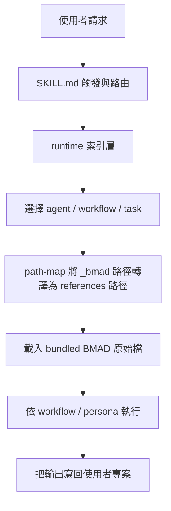

這份文件用來完整拆解 `bmad-method-complete`。它不是安裝教學，而是研究手冊，目標是讓你理解這個 pure skill 版 BMAD 如何在沒有 `_bmad` 安裝樹的前提下，仍然重現 BMAD 的主要能力。

## 你會學到什麼

- 這個 skill 為什麼存在，以及它解決了什麼問題
- 它與原版 BMAD 安裝版之間的差異與對應關係
- skill 內部的目錄結構、索引層、資源層與執行層
- `/bmad-help`、agent、workflow、task、party mode 在 pure skill 版中的實作方式
- `_bmad/...` 路徑如何被轉譯成 skill 內的 `references/...`
- 如何更新、重建、擴充、除錯這個 skill

:::tip[快速理解]
把 `bmad-method-complete` 想成「把 BMAD 安裝後會散落在 `_bmad/`、`_config/`、agent prompt、workflow prompt 裡的內容，全部重新整理成一個可被 Codex 直接載入的 skill 包」。它不是單一 prompt，而是一個帶有索引、manifest、路徑映射與完整原始資源的迷你 runtime。
:::

## 為什麼要做成 Pure Skill

原版 BMAD 的使用方式，通常依賴安裝程序把檔案鋪到專案內：

```text
your-project/
├── _bmad/
│   ├── core/
│   ├── bmm/
│   └── _config/
├── _bmad-output/
└── IDE-specific command files
```

這種方式很適合正式專案使用，但不適合以下情境：

- 你只想研究 BMAD 的能力，不想先跑安裝器
- 你想把 BMAD 當作單一 skill 分發、測試或移植
- 你想在沒有 `_bmad` 實體目錄的環境中，仍然使用 BMAD 的 agent 與 workflow
- 你想把 BMAD 的「知識與流程」跟「安裝後的專案狀態」拆開

因此，pure skill 版的核心目標不是重新發明 BMAD，而是把 BMAD 的功能面重新封裝成 skill-native 結構。

## 它和原版 BMAD 的關係

| 項目 | 原版 BMAD | `bmad-method-complete` |
| --- | --- | --- |
| 核心資源位置 | `_bmad/` | `skills/bmad-method-complete/references/bmad/` |
| config / manifest | `_bmad/_config/` | `skills/bmad-method-complete/references/runtime/` |
| 啟動方式 | 安裝器 + IDE 命令 | 單一 skill 觸發 |
| agent / workflow 載入 | IDE prompt 或 slash command | skill 內 routing |
| 輸出位置 | 專案工作目錄 | 仍然輸出到專案工作目錄 |
| `/bmad-help` | 已安裝命令 | 當作 alias 路由到 bundled help task |
| `_bmad/core/config.yaml` | 實體檔案 | 以 synthetic defaults 在記憶體模擬 |

最重要的一點是：

這個 skill 並沒有改寫 BMAD 的核心 workflow 內容，而是將原始檔案整包複製進 `references/`，再在 skill 層補上「如何找到這些檔案」與「沒有 `_bmad` 時如何繼續運作」這兩件事。

## 建議的閱讀順序

如果你想有效率地研究整個 skill，建議照這個順序看：

1. `skills/bmad-method-complete/SKILL.md`
2. `skills/bmad-method-complete/references/runtime/capability-map.md`
3. `skills/bmad-method-complete/references/runtime/skill-manifest.json`
4. `skills/bmad-method-complete/references/runtime/bmad-help.csv`
5. `skills/bmad-method-complete/references/runtime/agent-index.md`
6. `skills/bmad-method-complete/references/runtime/workflow-index.md`
7. `skills/bmad-method-complete/references/bmad/core/tasks/workflow.xml`
8. `skills/bmad-method-complete/references/bmad/core/tasks/help.md`
9. 任一實際 agent 或 workflow 原始檔
10. `skills/bmad-method-complete/scripts/build_bundle.py`

前四項會先讓你知道「skill 怎麼思考」；後面幾項才是「BMAD 本體怎麼工作」。

## 整體架構

可以把這個 skill 看成四層：

| 層級 | 主要位置 | 負責什麼 |
| --- | --- | --- |
| 入口層 | `SKILL.md` | 定義觸發條件、路由規則、path translation、synthetic install state |
| 索引層 | `references/runtime/` | 提供 agent/workflow/task/help 的可機器讀取索引 |
| 資源層 | `references/bmad/` | 保存 BMAD 的核心原始資源 |
| 說明層 | `references/docs/` | 保存 BMAD 的 reference 文件，供解釋與研究使用 |

### 運作流程圖



## 目錄結構總覽

`skills/bmad-method-complete/` 的重要結構如下：

```text
skills/bmad-method-complete/
├── SKILL.md
├── agents/
│   └── openai.yaml
├── scripts/
│   └── build_bundle.py
└── references/
    ├── runtime/
    │   ├── capability-map.md
    │   ├── skill-manifest.json
    │   ├── path-map.json
    │   ├── defaults.json
    │   ├── bmad-help.csv
    │   ├── agent-manifest.csv
    │   ├── workflow-manifest.csv
    │   ├── task-manifest.csv
    │   ├── agent-index.md
    │   ├── workflow-index.md
    │   └── task-index.md
    ├── bmad/
    │   ├── core/
    │   ├── bmm/
    │   └── utility/
    └── docs/
        ├── reference/
        └── reference_cn/
```

這個結構背後的設計原則很清楚：

- `SKILL.md` 不重複儲存 BMAD 內容本身，只定義如何使用 bundle
- `runtime/` 存放導覽與機器索引
- `bmad/` 存放實際要被執行的來源
- `docs/` 存放輔助理解的 reference 文件

## 入口層：SKILL.md 在做什麼

`SKILL.md` 是另一個 Codex 實際會先讀的檔案，因此它的任務不是教人，而是教模型如何操作這個 skill。

它主要做六件事：

### 1. 定義觸發語意

frontmatter 的 `description` 明確寫出：

- 使用者提到 BMAD
- 使用者提到 `/bmad-help`
- 使用者提到 `CP`、`CA`、`DS`、`PM` 等短碼
- 使用者想用 BMAD agent、workflow、quick flow、review、party mode

都應該觸發這個 skill。

### 2. 指定 routing order

它不是叫模型一股腦把所有 `references/` 都讀進來，而是規定：

- 問下一步就先讀 help task 與 help catalog
- 問 agent persona 就先讀 agent index
- 問 workflow 就先讀 workflow index 與對應 workflow
- 問 standalone task 就先讀 task index

這是避免上下文爆炸的關鍵。

### 3. 定義 path translation

BMAD 原始檔大量引用 `_bmad/...` 與 `{project-root}/_bmad/...`。

如果 pure skill 版不處理這件事，workflow 一打開就會失效。`SKILL.md` 因此明確規定：

- `_bmad/<...>` 視為 `references/bmad/<...>`
- `{project-root}/_bmad/<...>` 若指向 BMAD runtime 資源，也轉成 `references/bmad/<...>`
- `{project-root}` 仍然保留作為使用者專案根目錄

這讓 pure skill 版能同時做到兩件事：

- 載入 bundled BMAD 本體
- 把輸出與專案工件留在使用者工作區

### 4. 建立 synthetic install state

安裝版 BMAD 預期會有：

- `_bmad/core/config.yaml`
- `_bmad/_config/bmad-help.csv`
- `_bmad/_config/agent-manifest.csv`
- `_bmad/_config/workflow-manifest.csv`
- `_bmad/_config/task-manifest.csv`

但 pure skill 沒有這些實體檔案，因此 `SKILL.md` 規定在缺少它們時，用 `references/runtime/defaults.json` 和 runtime CSV 來模擬安裝後狀態。

### 5. 規範 agent execution

一旦選定 agent，skill 會：

1. 載入完整 agent YAML
2. 採用 persona、principles、critical actions、menu
3. 把短碼、fuzzy match、slash command 都視為同一件事
4. 若 menu 指向 workflow，就進入 workflow execution
5. 若 menu 是 action，就直接以 persona 方式執行

### 6. 規範 workflow execution

當進到 workflow 時，skill 不應該只摘要流程，而是要遵守 BMAD 的 workflow engine 規則：

- 先 resolve workflow
- 載入完整 workflow 檔
- 若 workflow 受 `core/tasks/workflow.xml` 管理，就讀完整 engine
- 依序載入 steps、instructions、checklist、template、validation
- 遵守 `template-output`、optional step、party mode、YOLO 等語意
- 將輸出寫入使用者專案

## 索引層：`references/runtime/` 的角色

這層是 pure skill 成功的真正關鍵。沒有這層，你只有一堆檔案；有了這層，模型才知道從哪裡開始。

### `capability-map.md`

這是總覽入口。它提供：

- 目前 bundle 內 agent 數量
- standalone task 數量
- help catalog 數量
- phase coverage
- synthetic config defaults
- path translation 摘要

研究 skill 時，最先讀這個檔通常是最省成本的作法。

### `skill-manifest.json`

這是最完整的機器可讀索引。裡面包含：

- bundle 生成時間
- source version
- copied roots
- 各種數量統計
- synthetic config defaults
- path prefix 規則
- agents 清單
- standalone tasks 清單
- help catalog 全量資料

如果你想寫工具或二次處理，這個檔是最重要的來源。

### `bmad-help.csv`

這個檔對應 BMAD 的「下一步路由器」。它融合了：

- core module-help
- bmm module-help
- agent manifest 補充資訊

欄位包括：

- module
- phase
- name
- code
- sequence
- workflow-file
- command
- required
- agent-name
- agent-command
- agent-display-name
- agent-title
- options
- description
- output-location
- outputs

這就是 pure skill 版 `/bmad-help` 的依據。

### `agent-manifest.csv`

這是 party mode 與 agent 導航的基礎索引，包含：

- agent key
- display name
- title
- icon
- capabilities
- role
- identity
- communication style
- principles
- module
- path

它的作用不是取代 agent YAML，而是先讓模型知道有哪些 agent 存在，以及各自大概負責什麼。

### `workflow-manifest.csv`

這是所有 user-facing workflow 的扁平索引。你可以把它看成：

- workflow 名稱
- workflow 簡述
- 所屬 module
- workflow 原始路徑

它主要解決「我要找哪一個 workflow 檔」這件事。

### `task-manifest.csv`

這是 pure skill 暴露出來的 standalone core task 索引，例如：

- help
- shard document
- index docs
- editorial review
- adversarial review
- edge case hunter

BMAD 的 `workflow.xml` 這種 internal engine 沒有放進 standalone task manifest，因為它不是給使用者直接呼叫的工具。

### `agent-index.md`、`workflow-index.md`、`task-index.md`

這三個檔案是給人類與模型快速掃描用的 markdown 版本：

- `agent-index.md` 適合快速找 agent 及其 menu trigger
- `workflow-index.md` 適合快速找 phase、workflow code、command alias、預期輸出
- `task-index.md` 適合快速找可獨立執行的 core task

### `path-map.json`

這個檔案是 pure skill 能工作的重要保險絲。

它記錄了：

- `_bmad/...` 對應到哪個 `references/...`
- `{project-root}/_bmad/...` 對應到哪個 `references/...`
- `_bmad/_config/*.csv` 對應到哪個 runtime CSV
- `_bmad/core/config.yaml` 對應到哪個 defaults 檔
- tech-writer memory 對應到哪個實際文件

只要 BMAD 原始 workflow 或 agent 內還寫著安裝版路徑，pure skill 就可以透過這個 map 接手。

### `defaults.json`

這不是 BMAD 原本的 config 檔，而是 pure skill 版自己建立的「合成預設安裝狀態」。

它提供：

- `project_name`
- `user_name`
- `communication_language`
- `document_output_language`
- `output_folder`
- `planning_artifacts`
- `implementation_artifacts`
- `project_knowledge`
- `user_skill_level`
- tool capability flags

這些值不是要覆蓋使用者專案，而是讓 workflow 在缺少 `_bmad/core/config.yaml` 時不至於失去上下文。

## 資源層：`references/bmad/` 真正裝了什麼

這一層是 BMAD 本體。

### `references/bmad/core/`

包含 core module 的關鍵內容，例如：

- `tasks/workflow.xml`
- `tasks/help.md`
- `tasks/index-docs.xml`
- `tasks/shard-doc.xml`
- `tasks/review-adversarial-general.xml`
- `workflows/party-mode/`
- `workflows/brainstorming/`
- `workflows/advanced-elicitation/`
- `agents/bmad-master.agent.yaml`

這裡提供的是 BMAD 的通用執行引擎與基礎工具。

### `references/bmad/bmm/`

包含 BMad Method 軟體開發模組的主要內容，例如：

- analyst / pm / architect / dev / qa / sm / ux-designer / tech-writer agent 定義
- Phase 1 到 Phase 4 的 workflow
- quick-spec、quick-dev、quick-dev-new-preview
- document-project
- generate-project-context
- 各種 steps、instructions、templates、checklists、data

如果你要研究 BMAD 的軟體開發能力，大多數重點都在這裡。

### `references/bmad/utility/`

這裡放的是安裝與組裝 prompt 時用到的共用片段，例如 agent components。

pure skill 執行時未必每次都直接讀到它，但保留它有兩個價值：

- 研究 BMAD prompt 拼裝方式
- 後續擴充 exporter 或生成器時保有完整來源

## 說明層：`references/docs/`

這裡存的是 BMAD 現有 reference 文件，不是 runtime 必需，但對研究很有價值。

主要包括：

- `reference/agents.md`
- `reference/workflow-map.md`
- `reference/commands.md`
- `reference/modules.md`
- `reference/testing.md`
- 對應的中文 reference 檔

這一層主要解決：「我知道 skill 能跑，但我還想理解 BMAD 官方怎麼描述它自己」。

## Agent 系統是怎麼被重現的

### Agent 的資料來源

agent 來自：

- `src/core/agents/*.agent.yaml`
- `src/bmm/agents/*.agent.yaml`

打包器會解析每個 agent 的：

- metadata
- persona
- menu

再把整理後的資訊寫入 `agent-manifest.csv` 與 `skill-manifest.json`。

### 為什麼還要保留完整 agent YAML

因為 manifest 只能做導航，無法完整替代 persona 細節。

真正執行 agent 時，仍然要讀完整 YAML，因為裡面有：

- communication style
- principles
- critical actions
- menu action/workflow 指令
- 某些 agent 的特殊 sidecar memory 規則

### Tech Writer 是一個特殊案例

`tech-writer` 不只是一個 agent，還依賴 sidecar memory：

- `references/bmad/bmm/agents/tech-writer/tech-writer-sidecar/documentation-standards.md`

因此 pure skill 版除了保留 agent YAML，也把這份 memory 檔一起納入 path map。否則 `WD`、`US`、`VD`、`EC` 這些能力都會失去依據。

## Workflow 系統是怎麼被重現的

### 核心觀念：workflow runner 與 workflow definition 分離

BMAD 不是「每個 workflow 都是一份獨立大 prompt」，而是：

- 一個通用 workflow engine：`core/tasks/workflow.xml`
- 多個 workflow definition：各自的 `workflow.md` 或 `workflow.yaml`
- 多個步驟檔：`steps/`
- 多個模板與 checklist：`templates/`、`checklist.md`

pure skill 版的關鍵不是把結果摘要進 `SKILL.md`，而是保留這個分層結構。

### `workflow.xml` 的角色

`references/bmad/core/tasks/workflow.xml` 是 BMAD 最接近「執行系統」的東西。它規定：

- workflow 初始化時要讀哪些東西
- 如何 resolve config 與變數
- 如何處理 optional step
- 如何處理 `template-output`
- 如何處理 `invoke-workflow` 與 `invoke-task`
- 如何保存輸出
- 什麼是 normal mode，什麼是 yolo mode

因此 pure skill 版只要仍然能找到它，BMAD workflow 的行為就不會退化成普通 prompt。

### 為什麼很多 workflow 還能直接沿用原檔

因為 exporter 沒有改寫 workflow 內容，而是把原始檔完整帶進 bundle。

只要 skill 能處理：

- 路徑轉譯
- config fallback
- manifest fallback

原始 workflow 就仍然成立。

### Party Mode 為什麼也能保留

party mode 依賴：

- party-mode workflow
- `step-01-agent-loading.md`
- `step-02-discussion-orchestration.md`
- `step-03-graceful-exit.md`
- `agent-manifest.csv`

只要 manifest 存在，並且路由層知道 `_bmad/_config/agent-manifest.csv` 應該改讀 `references/runtime/agent-manifest.csv`，party mode 就能在 pure skill 裡繼續工作。

## `/bmad-help` 在 Pure Skill 版中怎麼成立

原版安裝版的 `/bmad-help`，本質上是：

1. 讀 `core/tasks/help.md`
2. 讀 `_bmad/_config/bmad-help.csv`
3. 判斷目前進度與下一步

pure skill 版完整保留了這個模型，只把來源改成：

1. `references/bmad/core/tasks/help.md`
2. `references/runtime/bmad-help.csv`
3. 若需要 agent 補充資訊，再讀 `references/runtime/agent-manifest.csv`

也就是說，這個 skill 不是模仿 `/bmad-help` 的表面回覆，而是盡可能保留它原來的 routing 邏輯。

## Path Translation 的必要性

如果你翻 BMAD 原始檔，會看到大量這類路徑：

```text
{project-root}/_bmad/core/tasks/workflow.xml
{project-root}/_bmad/_config/agent-manifest.csv
_bmad/_memory/tech-writer-sidecar/documentation-standards.md
```

在 pure skill 版裡，這些路徑如果不翻譯，幾乎所有 agent 與 workflow 都會斷。

因此設計上採用了雙層保護：

### 第一層：`SKILL.md` 的文字規則

它直接告訴模型：

- 哪些 `_bmad` 路徑要視為 bundled references
- 哪些 `{project-root}` 要維持為使用者專案

### 第二層：`path-map.json`

它把常見關鍵路徑明確列出，例如：

- `_bmad/_config/bmad-help.csv`
- `_bmad/_config/agent-manifest.csv`
- `_bmad/_config/workflow-manifest.csv`
- `_bmad/_config/task-manifest.csv`
- `_bmad/core/config.yaml`
- `_bmad/_memory/tech-writer-sidecar/documentation-standards.md`

這樣即使 workflow 或 agent 文字裡直接寫死安裝版路徑，pure skill 仍有對應表可查。

## Synthetic Install State 的設計哲學

pure skill 版沒有真的去 user project 建出一個 `_bmad/` 樹，理由有三個：

### 1. 保持 skill 純度

如果一個 skill 一開始就要求使用者先做安裝，它就失去 pure skill 的意義。

### 2. 減少副作用

研究型使用者很多時候只想讀、想測，不想讓工作目錄出現大量新檔案。

### 3. 把 runtime 狀態與 project 狀態拆開

BMAD 資源本身是 skill bundle 的一部分；專案輸出工件則屬於使用者工作區。這兩者概念上不同，分開處理更乾淨。

因此 pure skill 版選擇：

- BMAD runtime 用 `references/` 提供
- 專案輸出仍寫回 `{project-root}`
- 缺少的 config 則用 defaults 在記憶體中補齊

## 打包器 `build_bundle.py` 做了什麼

這支腳本不是裝飾品，而是整個 pure skill 版能維護的原因。

它主要做八件事：

### 1. 清空並重建 bundle 目錄

它會重建：

- `references/bmad/`
- `references/runtime/`
- `references/docs/`

這表示每次重建都以 source repo 為準，不依賴先前舊產物。

### 2. 複製 BMAD 原始資源

它會從 repo 複製：

- `src/core`
- `src/bmm`
- `src/utility`
- `docs/reference`
- `docs_cn/reference`

### 3. 解析 agent 定義

它會掃描 `*.agent.yaml`，抽取：

- display name
- title
- icon
- capabilities
- role
- identity
- communication style
- principles
- menu

### 4. 解析 standalone task

它會掃描 `src/core/tasks`，排除 internal task，收集可被獨立暴露的 task。

### 5. 載入並整合 help catalog

它會把：

- `src/core/module-help.csv`
- `src/bmm/module-help.csv`

合併成一份 enriched `bmad-help.csv`，並補上 agent display name / title / agent command。

### 6. 生成 runtime manifest

它會輸出：

- `agent-manifest.csv`
- `workflow-manifest.csv`
- `task-manifest.csv`
- `bmad-help.csv`

### 7. 建立 `path-map.json`

它會根據實際 bundle 檔案，產生 `_bmad/...` 與 `references/...` 之間的映射，並補入特殊 alias。

### 8. 建立研究友善索引

它會生成：

- `capability-map.md`
- `agent-index.md`
- `workflow-index.md`
- `task-index.md`
- `skill-manifest.json`

這一步讓 skill 不只是能執行，還能被研究。

## 你應該如何實際研究這個 Skill

如果你的目標是「徹底理解」，建議你用四種角度來看。

### 角度一：看它怎麼觸發

先讀：

- `SKILL.md`
- `agents/openai.yaml`

這會讓你知道：

- 什麼樣的 user request 會喚起 skill
- UI metadata 長什麼樣子
- skill 預設是如何自我定位

### 角度二：看它怎麼路由

再讀：

- `capability-map.md`
- `workflow-index.md`
- `task-index.md`
- `bmad-help.csv`

這會讓你知道：

- 從問題到功能的映射
- phase 與 code 的對應
- agent 與 workflow 的關係

### 角度三：看它怎麼執行

接著讀：

- `core/tasks/workflow.xml`
- `core/tasks/help.md`
- 某一個你最熟悉的 workflow，例如 `create-prd` 或 `quick-dev`

這會讓你知道：

- BMAD 的 runtime 規則
- workflow 為何不是平鋪 prompt
- `template-output` 與 step orchestration 的真正含義

### 角度四：看它怎麼生成

最後再讀：

- `scripts/build_bundle.py`
- `skill-manifest.json`

這會讓你知道：

- 這個 skill 不是手工整理，而是可重建
- 哪些內容是 source-derived，哪些是 pure skill 額外加上的

## 與安裝版相比，哪些能力是等價的

目前這個 skill 的功能目標，是重現以下能力面：

- BMAD help 與下一步推薦
- agent persona 與 menu
- analysis、planning、solutioning、implementation workflows
- quick-spec 與 quick-dev
- party mode
- core review/editorial task
- tech-writer 的 documentation-oriented action

## 與安裝版相比，哪些地方仍然不同

:::caution[重要差異]
這個 skill 的目標是「功能等價」，不是「安裝形態等價」。
:::

差異主要有三點：

### 1. 沒有真正的 IDE slash command UI

安裝版通常會在 Claude Code、Cursor、Codex 等環境中生成工具特定命令檔。

pure skill 版不生成這些 UI integration，因此：

- `/bmad-help`
- `CP`
- `CA`
- `DS`
- `PM`

在 pure skill 中本質上都是 alias，最後會被路由到相同的 bundled 資源。

### 2. 沒有真正的 `_bmad/core/config.yaml`

pure skill 版不是在磁碟上建立完整 BMAD runtime 樹，而是在缺少 config 時用 defaults 補足。

### 3. 需要 skill 本身遵守 routing discipline

安裝版很多路由是由 IDE prompt/command 檔先切分好；pure skill 版則是把這些規則集中寫在 `SKILL.md` 與 runtime index 中，因此 skill 本身的規則品質更重要。

## 如何更新這個 Skill

如果 BMAD source repo 有更新，重建方式非常直接：

```bash
npm run skill:build:bmad-complete
```

這個命令會重新執行：

```bash
python3 skills/bmad-method-complete/scripts/build_bundle.py
```

重建後，以下內容都會同步更新：

- `references/bmad/`
- `references/docs/`
- `references/runtime/*.csv`
- `references/runtime/*.md`
- `references/runtime/*.json`

## 如何擴充這個 Skill

如果你想再往前走，下面是最合理的擴充方向。

### 擴充方向一：加入更多 module

目前 bundle 聚焦在：

- `core`
- `bmm`

如果未來要納入其他 BMAD 生態模組，可以在打包器中擴充：

- source trees
- help source
- agent 解析來源
- workflow manifest 來源

### 擴充方向二：產生安裝器輸出

現在的 pure skill 版是研究與直接使用導向。如果你要分發給他人，可以再加：

- 自動複製到 `.agents/skills/`
- zip / tar.gz export
- 安裝後 smoke test

### 擴充方向三：強化驗證

目前已有重建與 smoke check，但你還可以再加：

- frontmatter / YAML schema 驗證
- manifest consistency 檢查
- path-map completeness 檢查
- 抽樣 workflow resolution test

## 如何除錯

研究 pure skill 時，最常見的問題通常不是內容缺失，而是路由理解錯誤。

### 問題一：某個 workflow 找不到檔案

先檢查：

- `workflow-index.md` 是否有該 workflow
- `skill-manifest.json` 中的 `helpCatalog` 是否有對應 row
- `path-map.json` 是否覆蓋了該 `_bmad/...` 路徑

### 問題二：某個 agent 能被辨識，但語氣不對

先檢查：

- 是否真的讀了完整 agent YAML
- 是否只讀了 manifest 而沒有讀 persona 原檔
- 是否漏了 tech-writer sidecar 之類的輔助記憶

### 問題三：`/bmad-help` 的下一步推薦看起來不合理

先檢查：

- `bmad-help.csv` 的 phase / sequence
- `required` 欄位
- 使用者目前工件位置是否與 synthetic defaults 一致
- 是否真的使用了 `core/tasks/help.md` 的原始規則，而不是自由發揮

## 研究時最值得特別注意的幾個檔案

如果你時間有限，最值得精讀的是下面這幾個：

| 檔案 | 為什麼值得讀 |
| --- | --- |
| `skills/bmad-method-complete/SKILL.md` | 這是 pure skill 版真正的操作說明書 |
| `skills/bmad-method-complete/scripts/build_bundle.py` | 這是整個 skill 可重建、可維護的關鍵 |
| `skills/bmad-method-complete/references/runtime/skill-manifest.json` | 最完整的機器索引 |
| `skills/bmad-method-complete/references/runtime/bmad-help.csv` | BMAD 路由核心 |
| `skills/bmad-method-complete/references/bmad/core/tasks/workflow.xml` | BMAD workflow 執行引擎 |
| `skills/bmad-method-complete/references/bmad/core/tasks/help.md` | `/bmad-help` 的真實規則 |
| `skills/bmad-method-complete/references/bmad/core/workflows/party-mode/workflow.md` | 多 agent 協作機制的核心 |
| `skills/bmad-method-complete/references/bmad/bmm/agents/pm.agent.yaml` | 典型 agent persona + menu 範例 |
| `skills/bmad-method-complete/references/bmad/bmm/workflows/2-plan-workflows/create-prd/workflow-create-prd.md` | 典型規劃型 workflow 範例 |

## 一句話總結這個 Skill

`bmad-method-complete` 的本質，是把 BMAD 從「安裝型框架」轉成「可直接觸發的 skill runtime」，並透過索引、manifest、path map、synthetic config 讓它在沒有 `_bmad` 實體安裝的情況下，仍然保留 BMAD 的 workflow 驅動能力。

:::tip[研究建議]
如果你真的要徹底吃透它，不要只讀 `SKILL.md`。最有效的方法是同時對照 `SKILL.md`、`skill-manifest.json`、`workflow.xml`、任一實際 workflow，這樣你會同時看到「入口規則、索引結構、執行引擎、業務流程」四個層面如何扣在一起。
:::
